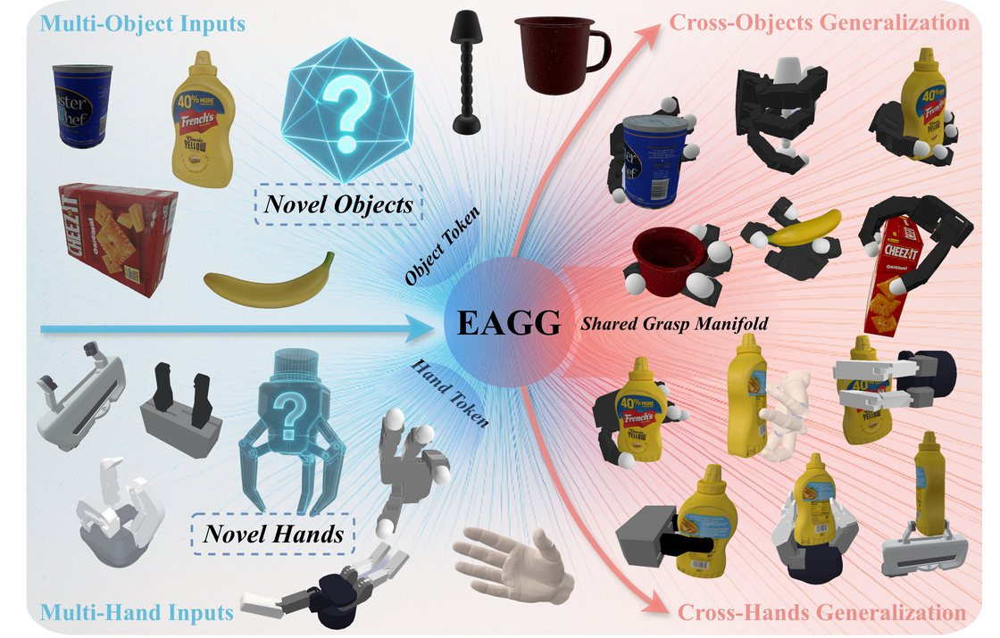
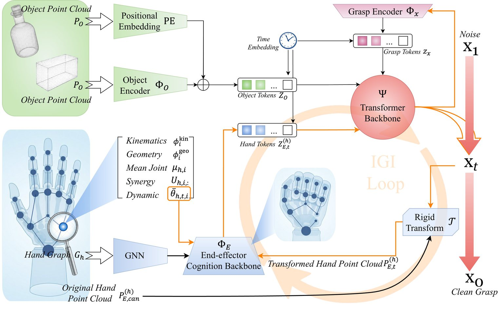
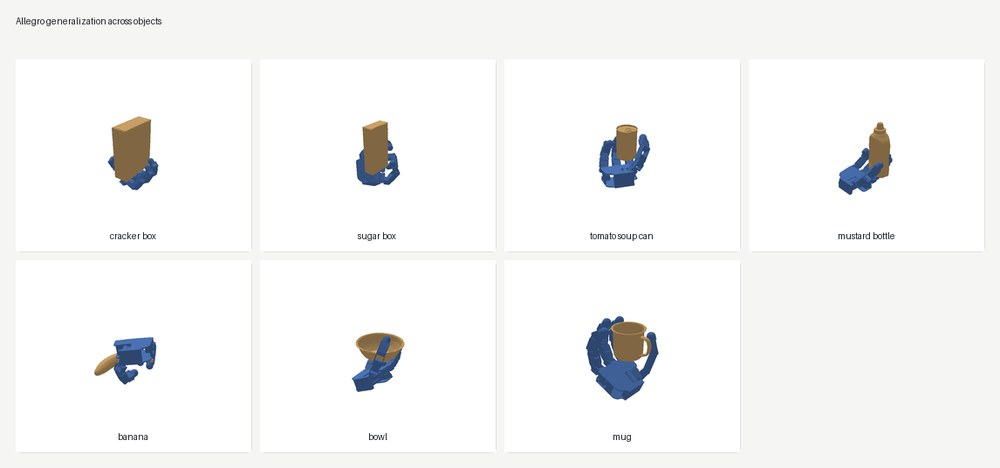
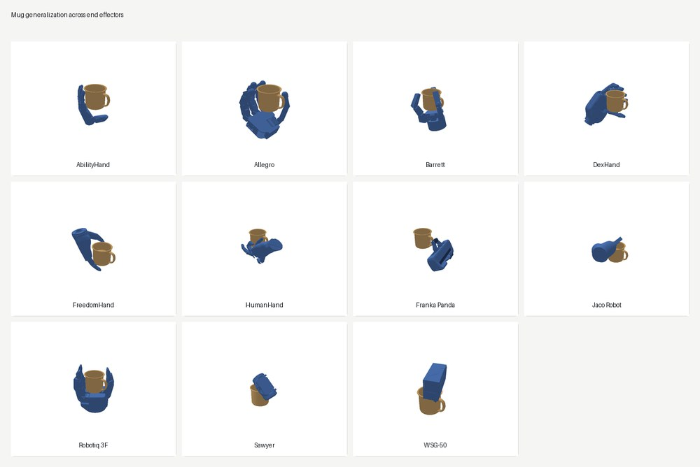

<div align="center">

# EAGG

**Embodiment-Aligned Grasp Generation via Geometry-Aware Graph Conditioning**

EAGG generates object-conditioned grasps for heterogeneous robotic hands and
grippers by conditioning the generator on both object geometry and
end-effector structure.

<p>
  <a href="README_CN.md">中文</a> |
  <a href="https://wanhaoniu.github.io/EAGG/">Project Page</a> |
  <a href="https://arxiv.org/abs/2606.18092">Paper</a> |
  <a href="#core-idea">Core Idea</a> |
  <a href="#installation">Installation</a> |
  <a href="#quick-start">Quick Start</a> |
  <a href="#training-from-scratch">Training</a> |
  <a href="#visualization-examples">Visualization</a> |
  <a href="#citation">Citation</a>
</p>

<p>
  <a href="https://arxiv.org/abs/2606.18092"></a>
  
  
  
  
</p>

</div>

<p align="center">
  
</p>

## Core Idea

Cross-end-effector grasp generation requires one model to generalize along two
coupled axes: across objects and across embodiments. The difficulty is that
different hands and grippers do not share a single raw joint space. Their
topology, actuation coupling, closure behavior, and contact geometry can differ
substantially, so a static hand label or morphology token is not enough.

EAGG addresses this by aligning embodiment structure inside a shared generator
rather than suppressing it. Each end effector keeps its own PCA-based
low-dimensional control space, while a topology-aware graph preserves how the
end effector is organized. During sampling, a frozen end-effector-cognition
backbone converts the current articulated state into geometry-aware tokens, and
Iterative Geometry Injection (IGI) refreshes those tokens so the generator stays
synchronized with the evolving hand/gripper geometry.

| Paper component | Role in EAGG |
| --- | --- |
| Embodiment-specific control basis | Expresses grasps without forcing all hands into one raw joint parameterization |
| Topology-aware end-effector graph | Preserves kinematic organization, coupling, and embodiment-specific structure |
| Frozen end-effector-cognition backbone | Provides reusable geometry-aware morphology tokens from the current articulated state |
| Iterative Geometry Injection | Updates end-effector conditioning throughout sampling as contact and collision geometry evolve |

This repository includes checkpoint inference, mesh visualization, training
from scratch on an MGG-style dataset, hand caches, synergy files, URDF files,
visual mesh assets, and clean demo object meshes. The pretrained final and
per-gripper model weights are distributed as a separate checkpoint archive.

## Method Overview

<p align="center">
  
</p>

The paper figures used in this README are stored under `assets/figures/`.
Demo objects, hand/gripper assets, and training entry points are included here.
Place the training grasp collection locally under `data/` when training.

## Installation

The canonical dependency list is in `requirements.txt`. The inference and
rendering tools use common Python packages and do not require a physics
simulator.

Recommended environment:

| Component | Recommendation |
| --- | --- |
| Python | 3.10 or 3.11 |
| PyTorch | 2.0 or newer |
| Accelerator | CUDA GPU for training and normal inference; CPU is supported for quick checks |
| Memory | 8 GB or more system memory for inference demos |
| Rendering | Matplotlib Agg backend, no display server required |

Main Python packages: `torch`, `numpy`, `scipy`, `matplotlib`, `pillow`,
`trimesh`, `urdfpy`, `networkx`, `scikit-learn`, and `tqdm`.

Start from the release directory:

```bash
cd EAGG_open_source
```

Create an isolated Python environment:

```bash
conda create -n eagg python=3.11 -y
conda activate eagg
python -m pip install --upgrade pip
```

Install PyTorch first. Choose the command that fits your environment. For a
CUDA 12.1 Linux environment:

```bash
python -m pip install torch --index-url https://download.pytorch.org/whl/cu121
```

For CPU-only usage:

```bash
python -m pip install torch --index-url https://download.pytorch.org/whl/cpu
```

Then install the remaining packages:

```bash
python -m pip install -r requirements.txt
```

Run a dependency import check:

```bash
python - <<'PY'
import torch, numpy, scipy, matplotlib, trimesh, urdfpy, sklearn
print("torch:", torch.__version__)
print("cuda available:", torch.cuda.is_available())
print("environment ok")
PY
```

Before running inference, download the pretrained checkpoint archive:

[EAGG_checkpoints.zip](https://drive.google.com/file/d/1P833ueGaeY1Gt66MdIVSgP0xxKxHFgG8/view?usp=sharing)

Put the archive in the repository root and extract it:

```bash
unzip EAGG_checkpoints.zip -d .
```

After extraction, the expected layout is:

```text
checkpoints/
  final/
    eagg_base.pth
    eagg_hand_cognition.pth
  per_gripper/
    Allegro.pth
    Barrett.pth
    franka_panda.pth
    robotiq_3finger.pth
    ...
```

The hand-cognition cache files under `data/cache/hand_cognition/` are also
required by inference, visualization, and training. They are small derived
assets, not learned model weights. Each file named
`*_pts1024_syn4_scale10_v2.pt` stores topology-aware node features, adjacency,
the sampled canonical hand/gripper cloud, and synergy statistics generated from
the corresponding URDF visual meshes and synergy PCA file.

The release includes these cache files. To verify them or build any missing
ones, run:

```bash
python tools/build_hand_cognition_cache.py --grippers all
```

If you edit a URDF, mesh, or synergy file, rebuild the affected cache:

```bash
python tools/build_hand_cognition_cache.py --grippers Allegro franka_panda --rebuild
```

## Quick Start

Run checkpoint inference on the bundled bowl point cloud:

```bash
python tools/infer_and_visualize.py \
  --checkpoint checkpoints/final/eagg_base.pth \
  --gripper Allegro \
  --point-cloud demo_data/point_clouds/024_bowl.xyz \
  --num-samples 8 \
  --steps 8 \
  --device cuda \
  --no-preview \
  --out-dir outputs/demo_allegro
```

Output:

```text
outputs/demo_allegro/
  Allegro_grasps.json
```

For a CPU-only check, use fewer samples and steps:

```bash
python tools/infer_and_visualize.py \
  --checkpoint checkpoints/final/eagg_base.pth \
  --gripper Allegro \
  --point-cloud demo_data/point_clouds/024_bowl.xyz \
  --num-samples 2 \
  --steps 2 \
  --device cpu \
  --no-preview \
  --out-dir outputs/smoke_allegro
```

Use `--object-id 024_bowl` instead of `--point-cloud ...` after placing an
object model library under `data/Object_Models/`.

Each generated grasp stores a 7D wrist pose `[x, y, z, qw, qx, qy, qz]` and a
decoded joint/control vector for the selected hand or gripper.

## Training From Scratch

The training entry point expects the MultiGripperGrasp (MGG) dataset format and
uses the included synergy files and hand-cognition cache. EAGG generator
training uses a frozen hand-cognition backbone; the released checkpoint archive
includes the required backbone weight at
`checkpoints/final/eagg_hand_cognition.pth`, and
`train/train_from_scratch.py` loads it by default.

To train the hand-cognition backbone yourself before generator training:

```bash
python train/pretrain_hand_cognition.py \
  --grippers all \
  --epochs 300 \
  --batch-size 1024 \
  --samples-per-epoch 100000 \
  --device cuda \
  --out-dir checkpoints/training_runs/hand_cognition
```

The script writes:

```text
checkpoints/training_runs/hand_cognition/
  latest_checkpoint.pth
  eagg_hand_cognition_best.pth
  eagg_hand_cognition_final.pth
```

Pass the resulting backbone checkpoint to generator training with `--hand-init`.
The default model scale uses a 4-dimensional control code, 1024 object points,
256 hidden dimension, 8 attention heads, 8 transformer blocks, batch size 420,
learning rate `2e-4`, and 10 epochs.

Full training example:

```bash
python train/train_from_scratch.py \
  --data-root data/graspit_grasps \
  --object-models data/Object_Models \
  --epochs 10 \
  --batch-size 420 \
  --lr 2e-4 \
  --device cuda \
  --hand-init checkpoints/final/eagg_hand_cognition.pth \
  --out-dir checkpoints/training_runs/eagg_full
```

The training script writes:

```text
checkpoints/training_runs/eagg_full/
  eagg_best_epochXXX.pth
  eagg_final.pth
```

## Dataset

The training data format follows MultiGripperGrasp (MGG), an IROS 2024 dataset
for robotic grasping across diverse end effectors. MGG contains 30.4M grasps
from 11 grippers over 345 objects:

- Dataset and project page: [MultiGripperGrasp](https://irvlutd.github.io/MultiGripperGrasp/)

After downloading and extracting MGG, place the grasp annotations and object
models under this repository as follows:

```text
EAGG_open_source/
  data/
    graspit_grasps/
      Allegro/
        Allegro-003_cracker_box.json
      franka_panda/
        franka_panda-024_bowl.json
      ...
    Object_Models/
      003_cracker_box/
        points.xyz
        meshes/
          model.obj
      024_bowl/
        points.xyz
        meshes/
          model.obj
      ...
```

If the downloaded MGG archive already contains `graspit_grasps/` and
`Object_Models/`, replace `MGG_ROOT` with the extracted MGG root directory and
copy those two directories into `data/`:

```bash
mkdir -p data
cp -r MGG_ROOT/graspit_grasps data/
cp -r MGG_ROOT/Object_Models data/
```

If your local MGG copy uses different folder names, either rename them to the
layout above or pass explicit paths with `--data-root` and `--object-models`.
The `object_id` stored in each grasp JSON must match the folder name under
`data/Object_Models/`.

Each grasp JSON should include array fields in the MGG format:

```json
{
  "object_id": "024_bowl",
  "pose": [[0.0, 0.0, 0.0, 1.0, 0.0, 0.0, 0.0]],
  "final_dofs": [[0.0, 0.0]],
  "fall_time": [5.0]
}
```

`pose` is `[x, y, z, qw, qx, qy, qz]`. `final_dofs` must follow the DOF order
used by the corresponding configuration file under `isaac_sim_grasping/usd2urdf/`.

## Visualization Examples

Generate the README figures:

```bash
python tools/generate_readme_figures.py \
  --checkpoint-mode per_gripper \
  --num-samples 256 \
  --steps 10 \
  --top-k 3 \
  --selection proximity \
  --device cuda \
  --out-root outputs/readme_figures
```

This command runs checkpoint inference, selects the strongest candidates for
each evaluated object/end-effector pair, saves the top-3 renderings, and writes:

```text
assets/figures/readme_allegro_cross_object_preview.jpg
assets/figures/readme_mug_cross_gripper_preview.jpg
outputs/readme_figures/generation_summary.json
```

Each per-object/per-end-effector JSON also contains `ranked_candidates`, where
rank 1 is the selected candidate and lower proximity score is better. The
`candidate_renders` field lists the saved top-k images in sorted order.

The first gallery shows object-level generalization with the Allegro hand. The
same end effector is applied to all seven bundled clean objects, and each panel
overlays the object mesh with a selected generated grasp.

<p align="center">
  
</p>

The second gallery shows end-effector-level generalization on the mug object.
The object is fixed while the selected generated grasp is rendered for every
released hand or gripper.

<p align="center">
  
</p>

Use `--objects` to change the object set in the Allegro cross-object gallery,
or `--mug-object` to choose another fixed object for the cross-end-effector
gallery. The lower-level `tools/generate_gripper_gallery.py` script also accepts
explicit `--point-cloud` and `--object-mesh` paths.

The full review gallery is stored under `assets/figures/grasp_gallery/`. For
each of the 11 end effectors and 7 bundled objects, 256 candidates were
generated with 10 denoising steps, ranked, and the top 3 renders were kept.
Each end effector also has an overview sheet.

## Citation

If you find EAGG useful, please cite the [arXiv paper](https://arxiv.org/abs/2606.18092):

```bibtex
@misc{niu2026eagg,
  title = {EAGG: Embodiment-Aligned Grasp Generation via Geometry-Aware Graph Conditioning},
  author = {Niu, Wanhao and Ke, Qiyan and Sun, Yuan and Sun, Hao and Xu, Jie and Ma, Muyuan and Hu, Ruiqi and Sun, Fuchun},
  year = {2026},
  eprint = {2606.18092},
  archivePrefix = {arXiv},
  primaryClass = {cs.RO},
  doi = {10.48550/arXiv.2606.18092},
  url = {https://arxiv.org/abs/2606.18092}
}
```
