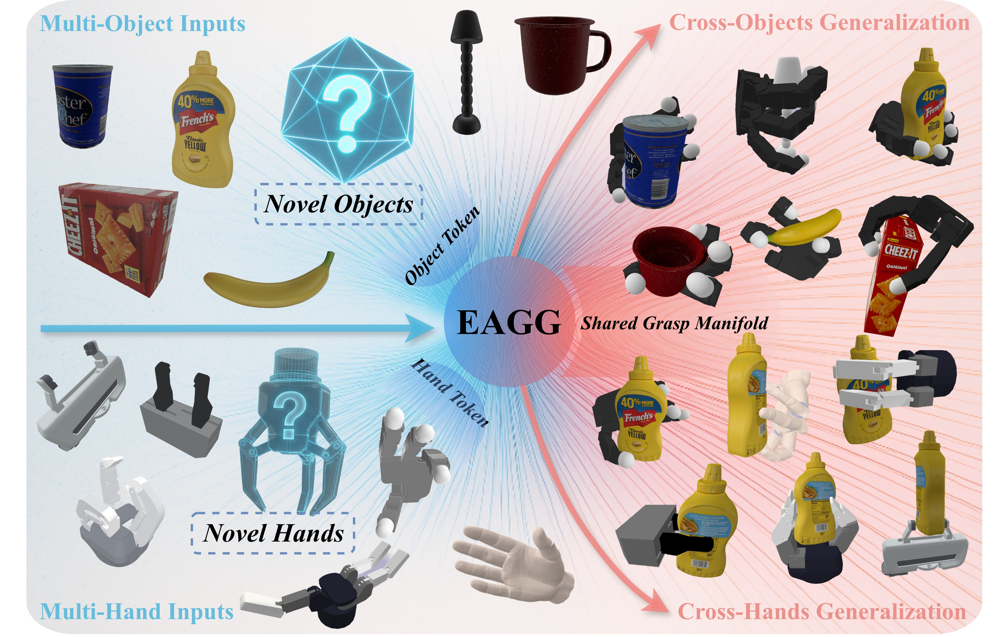
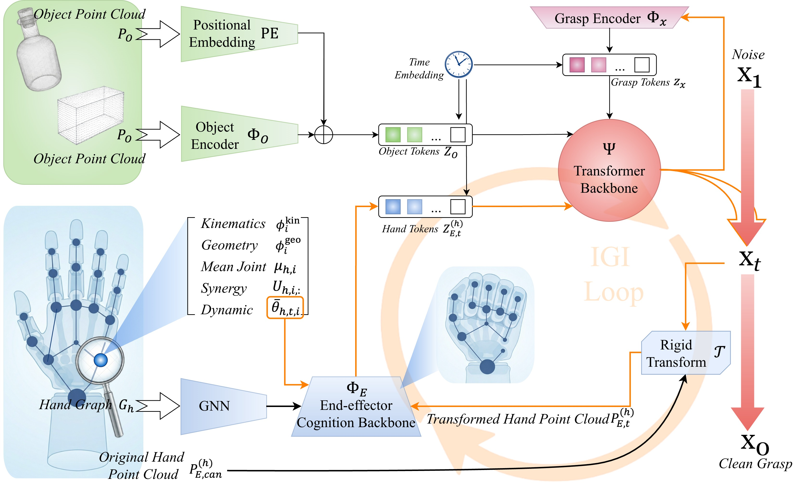
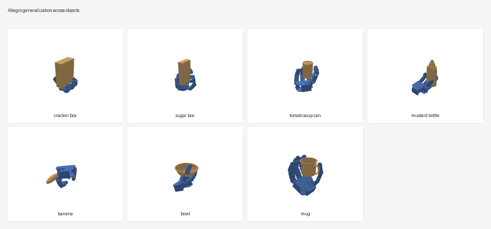
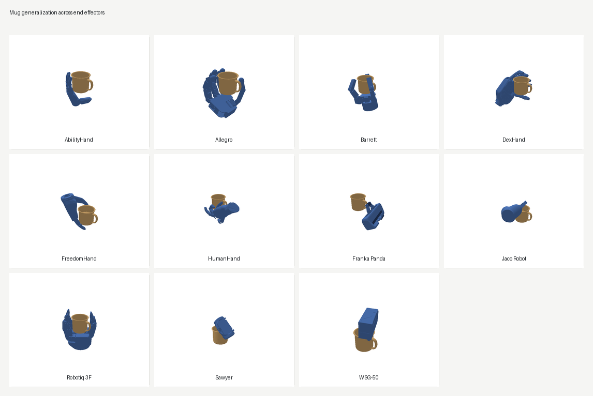

<div align="center">

# EAGG

**Embodiment-Aligned Grasp Generation via Geometry-Aware Graph Conditioning**

EAGG 面向异构机器人手和夹爪，根据物体几何生成抓取，并显式利用目标末端执行器的几何结构与运动学结构。

<p>
  <a href="README.md">English</a> |
  <a href="#核心思想">核心思想</a> |
  <a href="#安装与部署">安装</a> |
  <a href="#快速开始">快速开始</a> |
  <a href="#从头训练">训练</a> |
  <a href="#可视化示例">可视化</a> |
  <a href="#引用">引用</a>
</p>

<p>
  
  
  
  
</p>

</div>

<p align="center">
  
</p>

## 核心思想

Cross-end-effector grasp generation 需要一个模型同时沿着两个维度泛化：跨物体，以及跨不同 embodiment。困难在于，不同手/夹爪并不共享同一个 raw joint space；它们的拓扑、驱动耦合、闭合方式和接触几何可能差异很大。因此，只用一个静态 descriptor 或 morphology token 不能充分表达抓取应该如何在某个具体 embodiment 上实现。

EAGG 的核心做法是在同一个生成器内部对齐 embodiment structure，而不是抹平这些差异。每个末端执行器保留自己的 PCA-based low-dimensional control space，同时用 topology-aware graph 表示其运动学组织方式。采样过程中，冻结的 end-effector-cognition backbone 会把当前 articulated state 转换成 geometry-aware tokens；Iterative Geometry Injection (IGI) 会持续刷新这些 tokens，使生成器和不断变化的手/夹爪几何保持同步。

| 论文组件 | 在 EAGG 中的作用 |
| --- | --- |
| Embodiment-specific control basis | 表达抓取时不强制所有手共享同一个 raw joint parameterization |
| Topology-aware end-effector graph | 保留运动学组织、耦合关系和 embodiment-specific structure |
| Frozen end-effector-cognition backbone | 根据当前 articulated state 提供可复用的 geometry-aware morphology tokens |
| Iterative Geometry Injection | 在采样过程中更新末端执行器条件，使接触和碰撞几何随状态变化而同步 |

本仓库包含 checkpoint 推理、mesh 可视化、基于 MGG 风格数据集的从头训练、hand cache、synergy 文件、URDF 文件、visual mesh 资产和干净 demo 物体 mesh。预训练的最终模型权重和单手/单夹爪权重以独立 checkpoint 压缩包形式发布。

## 方法概览

<p align="center">
  
</p>

README 中使用的论文图片位于 `assets/figures/`。这里包含 demo 物体、手/夹爪资产和训练入口；训练抓取数据集请在本地训练时放到 `data/` 目录下。

## 安装与部署

标准依赖列表在 `requirements.txt` 中。推理和渲染工具只依赖常见 Python 包，不需要物理仿真器。

推荐环境：

| 组件 | 建议 |
| --- | --- |
| Python | 3.10 或 3.11 |
| PyTorch | 2.0 或更新版本 |
| 加速设备 | CUDA GPU 用于训练和常规推理；CPU 可用于快速检查 |
| 内存 | 推理 demo 建议至少 8 GB 系统内存 |
| 渲染 | Matplotlib Agg 后端，不需要显示服务器 |

主要 Python 包：`torch`、`numpy`、`scipy`、`matplotlib`、`trimesh`、`urdfpy`、`networkx`、`scikit-learn` 和 `tqdm`。

先进入发布目录：

```bash
cd EAGG_open_source
```

创建独立 Python 环境：

```bash
conda create -n eagg python=3.11 -y
conda activate eagg
python -m pip install --upgrade pip
```

先安装 PyTorch。请根据机器选择命令。CUDA 12.1 Linux 环境可以使用：

```bash
python -m pip install torch --index-url https://download.pytorch.org/whl/cu121
```

CPU-only 环境可以使用：

```bash
python -m pip install torch --index-url https://download.pytorch.org/whl/cpu
```

然后安装其余依赖：

```bash
python -m pip install -r requirements.txt
```

做一次 import 检查：

```bash
python - <<'PY'
import torch, numpy, scipy, matplotlib, trimesh, urdfpy, sklearn
print("torch:", torch.__version__)
print("cuda available:", torch.cuda.is_available())
print("environment ok")
PY
```

运行推理前，请先下载预训练 checkpoint 压缩包：

[EAGG_checkpoints.zip](https://drive.google.com/file/d/1P833ueGaeY1Gt66MdIVSgP0xxKxHFgG8/view?usp=sharing)

将压缩包放到仓库根目录并解压：

```bash
unzip EAGG_checkpoints.zip -d .
```

解压后应得到如下目录结构：

```text
checkpoints/
  final/
    eagg_base.pth
    eagg_hand_cognition.pth
  per_gripper/
    Allegro.pth
    Barrett.pth
    franka_panda.pth
    robotiq_3finger.pth
    ...
```

`data/cache/hand_cognition/` 下的 hand-cognition cache 同样是推理、可视化和训练所必需的文件。它们是从 URDF visual mesh 和 synergy PCA 文件生成出来的小型派生资产，不是模型权重。每个
`*_pts1024_syn4_scale10_v2.pt` 文件中保存了 topology-aware node features、adjacency、采样得到的 canonical hand/gripper cloud 和 synergy statistics。

发布包已经包含这些 cache 文件。如需检查或补齐缺失文件，可以运行：

```bash
python tools/build_hand_cognition_cache.py --grippers all
```

如果修改了某个手/夹爪的 URDF、mesh 或 synergy 文件，可以重新生成对应 cache：

```bash
python tools/build_hand_cognition_cache.py --grippers Allegro franka_panda --rebuild
```

## 快速开始

使用内置 bowl 点云运行 checkpoint 推理：

```bash
python tools/infer_and_visualize.py \
  --checkpoint checkpoints/final/eagg_base.pth \
  --gripper Allegro \
  --point-cloud demo_data/point_clouds/024_bowl.xyz \
  --num-samples 8 \
  --steps 8 \
  --device cuda \
  --no-preview \
  --out-dir outputs/demo_allegro
```

输出：

```text
outputs/demo_allegro/
  Allegro_grasps.json
```

CPU-only 检查可以减少 sample 和 step：

```bash
python tools/infer_and_visualize.py \
  --checkpoint checkpoints/final/eagg_base.pth \
  --gripper Allegro \
  --point-cloud demo_data/point_clouds/024_bowl.xyz \
  --num-samples 2 \
  --steps 2 \
  --device cpu \
  --no-preview \
  --out-dir outputs/smoke_allegro
```

当完整物体模型库已经放到 `data/Object_Models/` 后，也可以用 `--object-id 024_bowl` 代替 `--point-cloud ...`。

每个生成抓取包含 7 维腕部位姿 `[x, y, z, qw, qx, qy, qz]` 和对应手/夹爪的 decoded joint/control vector。

## 从头训练

训练入口期望使用 MultiGripperGrasp (MGG) 数据集格式，并复用发布包内的 synergy 文件和 hand-cognition cache。EAGG generator 训练时使用冻结的 hand-cognition backbone；发布的 checkpoint 压缩包中已经包含对应权重 `checkpoints/final/eagg_hand_cognition.pth`，`train/train_from_scratch.py` 默认会加载它。

如果希望先自行训练 hand-cognition backbone，可以运行：

```bash
python train/pretrain_hand_cognition.py \
  --grippers all \
  --epochs 300 \
  --batch-size 1024 \
  --samples-per-epoch 100000 \
  --device cuda \
  --out-dir checkpoints/training_runs/hand_cognition
```

脚本输出：

```text
checkpoints/training_runs/hand_cognition/
  latest_checkpoint.pth
  eagg_hand_cognition_best.pth
  eagg_hand_cognition_final.pth
```

后续训练 generator 时，可以通过 `--hand-init` 指定该 backbone checkpoint。默认模型规模为：4 维低维控制码、1024 个物体点、256 hidden dimension、8 个 attention heads、8 个 transformer blocks、batch size 420、学习率 `2e-4`、训练 10 个 epoch。

完整训练示例：

```bash
python train/train_from_scratch.py \
  --data-root data/graspit_grasps \
  --object-models data/Object_Models \
  --epochs 10 \
  --batch-size 420 \
  --lr 2e-4 \
  --device cuda \
  --hand-init checkpoints/final/eagg_hand_cognition.pth \
  --out-dir checkpoints/training_runs/eagg_full
```

训练脚本输出：

```text
checkpoints/training_runs/eagg_full/
  eagg_best_epochXXX.pth
  eagg_final.pth
```

## 数据集

训练数据格式来自 MultiGripperGrasp (MGG)，这是 IROS 2024 的多手/多夹爪机器人抓取数据集，包含 11 种 gripper、345 个物体和 30.4M 个抓取：

- 数据集与项目主页：[MultiGripperGrasp](https://irvlutd.github.io/MultiGripperGrasp/)

下载并解压 MGG 后，把抓取标注和物体模型放到本仓库的 `data/` 目录下：

```text
EAGG_open_source/
  data/
    graspit_grasps/
      Allegro/
        Allegro-003_cracker_box.json
      franka_panda/
        franka_panda-024_bowl.json
      ...
    Object_Models/
      003_cracker_box/
        points.xyz
        meshes/
          model.obj
      024_bowl/
        points.xyz
        meshes/
          model.obj
      ...
```

如果下载的 MGG 包里已经包含 `graspit_grasps/` 和 `Object_Models/` 两个目录，把 `MGG_ROOT` 替换成解压后的 MGG 根目录，然后复制到 `data/`：

```bash
mkdir -p data
cp -r MGG_ROOT/graspit_grasps data/
cp -r MGG_ROOT/Object_Models data/
```

如果本地 MGG 的目录名不同，可以按上面的结构重命名，或者在训练命令中通过 `--data-root` 和 `--object-models` 显式指定路径。每个抓取 JSON 中的 `object_id` 必须和 `data/Object_Models/` 下的物体文件夹名一致。

每个抓取 JSON 需要包含 MGG 格式的数组字段：

```json
{
  "object_id": "024_bowl",
  "pose": [[0.0, 0.0, 0.0, 1.0, 0.0, 0.0, 0.0]],
  "final_dofs": [[0.0, 0.0]],
  "fall_time": [5.0]
}
```

`pose` 的格式是 `[x, y, z, qw, qx, qy, qz]`。`final_dofs` 需要与 `isaac_sim_grasping/usd2urdf/` 中对应配置的 DOF 顺序一致。

## 可视化示例

生成 README 中的两张图：

```bash
python tools/generate_readme_figures.py \
  --checkpoint-mode per_gripper \
  --num-samples 256 \
  --steps 10 \
  --top-k 3 \
  --selection proximity \
  --device cuda \
  --out-root outputs/readme_figures
```

这条命令会运行 checkpoint 推理，为每个物体/末端执行器组合选择更合适的候选抓取，保存 top-3 渲染结果，并写出：

```text
assets/figures/readme_allegro_cross_object.png
assets/figures/readme_mug_cross_gripper.png
outputs/readme_figures/generation_summary.json
```

每个物体/末端执行器对应的 JSON 中也会包含 `ranked_candidates`。其中 rank 1
就是被选中的候选，proximity score 越低排序越靠前。`candidate_renders` 字段记录已经保存出来的 top-k 图片。

第一张图展示跨物体泛化：固定使用 Allegro hand，在 7 个内置干净物体上分别渲染选中的生成抓取。每个 panel 都把物体 mesh 与 Allegro 的抓取姿态叠加显示。

<p align="center">
  
</p>

第二张图展示跨夹爪/手泛化：固定 mug 物体，分别渲染 11 种末端执行器上选中的生成抓取。

<p align="center">
  
</p>

可以用 `--objects` 修改 Allegro 跨物体 gallery 中的物体集合，也可以用 `--mug-object` 为跨夹爪/手 gallery 指定另一个固定物体。底层的 `tools/generate_gripper_gallery.py` 也支持显式传入 `--point-cloud` 和 `--object-mesh`。

完整挑图集放在 `assets/figures/grasp_gallery/`。对 11 种末端执行器和 7
个内置物体中的每个组合，先用 10 个去噪步生成 256 个候选抓取，再排序并保留前三个渲染结果。每个末端执行器还包含一张 overview。

## 引用

如果 EAGG 对你的研究有帮助，请引用 arXiv 论文：

```bibtex
@misc{niu2026eagg,
  title = {EAGG: Embodiment-Aligned Grasp Generation via Geometry-Aware Graph Conditioning},
  author = {Niu, Wanhao and Sun, Hao and Rong, Yongfeng and Zhu, Zifan and Xie, Yuanyan and Zhou, Huaidong and Zhuang, Chungang and Sun, Fuchun},
  year = {2026},
  eprint = {arXiv:XXXX.XXXXX},
  archivePrefix = {arXiv},
  primaryClass = {cs.RO}
}
```
